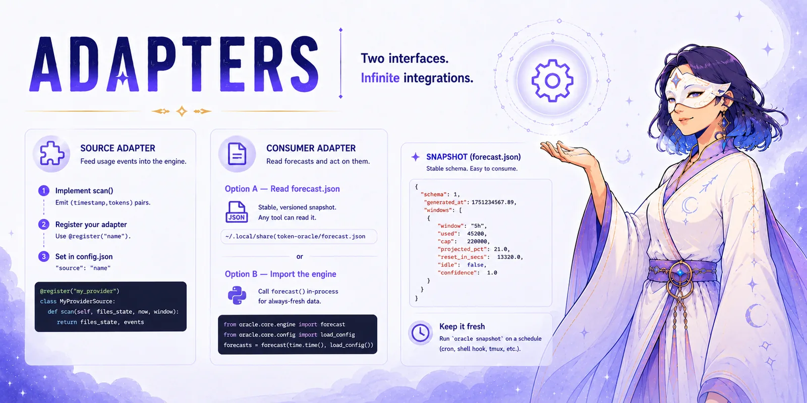

# ADAPTERS

<p align="center">
  <picture>
    <source srcset="assets/banner-adapters-oracle.avif" type="image/avif">
    <source srcset="assets/banner-adapters-oracle.webp" type="image/webp">
    
  </picture>
</p>

Two adapter interfaces let external code plug into token-oracle:

- **Source adapter** — feeds raw usage events into the forecast engine.
- **Consumer adapter** — reads the stable `forecast.json` snapshot (or imports
  the engine directly) to act on forecast data.

---

## Source interface

A source adapter turns provider-specific data into neutral event records. The
engine calls `scan()` on each refresh cycle.

### Event shape

An event is a 2–8 field array (tuple in memory):

```
[ts, tokens, model, input, output, cache_create, cache_read, cost_usd]
 0    1       2      3      4       5             6           7
```

| Field | Type | Description |
|---|---|---|
| `ts` | float | Epoch seconds |
| `tokens` | int | Limit-weighted token count (what the forecast math sums) |
| `model` | string or null | Model name, when known |
| `input` | int | Input token count (0 when absent) |
| `output` | int | Output token count (0 when absent) |
| `cache_create` | int | Cache-creation input tokens (0 when absent) |
| `cache_read` | int | Cache-read input tokens (0 when absent) |
| `cost_usd` | float or null | Reported USD cost, when known |

**Fields 0–1 are the only ones the forecast math reads** (see
`token_oracle/core/events.py`, `as_pairs`). A bare `[ts, tokens]` pair — the
original, minimal contract — remains valid forever; `core/events.py`'s
`normalize()` pads any 2–8 element sequence out to the full 8-tuple with
`None`/`0` defaults. Sources, the cache, and the engine all normalize through
this module, so a source may emit either shape.

### Contract

```python
from token_oracle.sources.base import register

@register("my_provider")
class MyProviderSource:
    def __init__(self, opts: dict):
        # opts comes from config.json "source_opts"
        ...

    def scan(
        self,
        files_state: dict,
        now: float,
        window: float,
    ) -> tuple[dict, list[tuple]]:
        """
        Return (updated_files_state, events).

        files_state  — opaque dict persisted in cache between calls; use it to
                       track file sizes / mtimes for incremental reads.
        now          — current epoch seconds (float).
        window       — look-back horizon in seconds; return only events in
                       [now - window, now].
        events       — list of 2-8 field event records (see "Event shape"
                       above), sorted ascending by timestamp (field 0).
        """
        ...
```

### Registration

Decorate your class with `@register("name")` before the engine imports it, and
set `"source": "name"` in `config.json`. The built-in sources register at import
time by being imported from `token_oracle.sources`.

To auto-register a third-party source, import it in your project's entry point
(or in a `conftest.py` / early startup module) before calling `oracle forecast`.

### Reference implementation — `generic` source (or see `grok.py` / `claude_code.py` for real log parsers)

Copy and adapt `token_oracle/sources/generic.py` as a starting point:

```python
"""token_oracle/sources/generic.py — copy this to build your own source adapter."""
import json
import os

from token_oracle.core import events as events_mod
from token_oracle.sources.base import register


@register("generic")
class GenericSource:
    def __init__(self, opts):
        self.events_path = os.path.expanduser(opts.get("events_path") or "")

    def scan(self, files_state, now, window):
        cutoff = now - window
        out = []
        try:
            with open(self.events_path, encoding="utf-8") as fh:
                data = json.load(fh)
            for row in data:
                if cutoff <= float(row[0]) <= now:
                    out.append(events_mod.normalize(row))
        except (OSError, ValueError, TypeError):
            pass
        out.sort(key=lambda e: e[0])
        return files_state, out
```

The `generic` source expects a JSON file at `source_opts["events_path"]`
containing an array of rows, each a `[timestamp_epoch, token_count]` pair or
a longer event record (see "Event shape" above):

```json
[
  [1751200000.0, 1234],
  [1751203600.0, 5678]
]
```

---

## Consumer interface

### Option A — read `forecast.json` (recommended for external tools)

`oracle snapshot` writes a stable versioned JSON file. Any tool can read it
without importing Python code.

**Default path:** `~/.local/share/token-oracle/forecast.json`  
Respects `$XDG_DATA_HOME`. Override with `oracle snapshot --out PATH`.

**Schema (version 1):**

```json
{
  "schema": 1,
  "generated_at": 1751234567.89,
  "windows": [
    {
      "window":          "5h",
      "used":            45200,
      "cap":             220000,
      "projected_pct":   21.0,
      "eta_to_cap_secs": null,
      "reset_in_secs":   13320.0,
      "idle":            false,
      "confidence":      1.0
    }
  ]
}
```

**Field reference:**

| Field | Type | Description |
|---|---|---|
| `schema` | int | Schema version (currently `1`) |
| `generated_at` | float | Epoch seconds when snapshot was written |
| `windows[].window` | string | Window name (from config) |
| `windows[].used` | int | Tokens consumed in current window |
| `windows[].cap` | int | Token cap for this window |
| `windows[].projected_pct` | float | Projected usage at window end as % of cap |
| `windows[].eta_to_cap_secs` | float or null | Seconds until cap is hit (null = not projected to hit) |
| `windows[].reset_in_secs` | float | Seconds until window resets |
| `windows[].idle` | bool | True when no usage events are observed |
| `windows[].confidence` | float | 0–1 confidence score for the projection |

`schema` is incremented on breaking changes. Consumers should check `schema == 1`
before reading.

**Example reader (Python):**

```python
import json
import os

path = os.path.expanduser("~/.local/share/token-oracle/forecast.json")
with open(path) as fh:
    snap = json.load(fh)

assert snap["schema"] == 1
for w in snap["windows"]:
    if not w["idle"]:
        print(f"{w['window']}: {w['used']}/{w['cap']}  "
              f"projected {w['projected_pct']:.0f}%  "
              f"resets in {w['reset_in_secs']/3600:.1f}h")
```

### Option B — import the engine directly

For tighter integration (same process, always fresh):

```python
import time
from token_oracle.core.engine import forecast
from token_oracle.core.config import load_config

cfg = load_config()                        # reads ~/.config/token-oracle/config.json
forecasts = forecast(time.time(), cfg)     # list[Forecast]; never raises

for f in forecasts:
    print(f.window, f.used, f.cap, f.projected_pct, f.reset_in_secs)
```

The `Forecast` dataclass (from `token_oracle.core.contracts`) has the same fields as
the snapshot `windows` objects above.

`forecast()` never raises — it returns `[]` on hard failure (missing source,
corrupt cache, etc.).

---

## Snapshot staleness

The snapshot file is written only when `oracle snapshot` (or `oracle snapshot
--out`) is run. It is not updated automatically by `oracle forecast` or by the
engine. Keep it fresh with a cron job, a shell alias, or a tmux
`status-interval` hook.

Example cron (every 5 minutes):

```
*/5 * * * * oracle snapshot >/dev/null 2>&1
```

`oracle snapshot` exits non-zero and prints to stderr if the file could not be written — don't discard stderr in cron if you want to notice.
